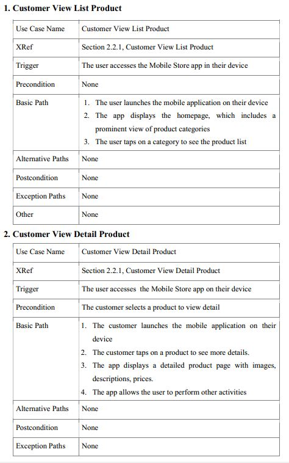
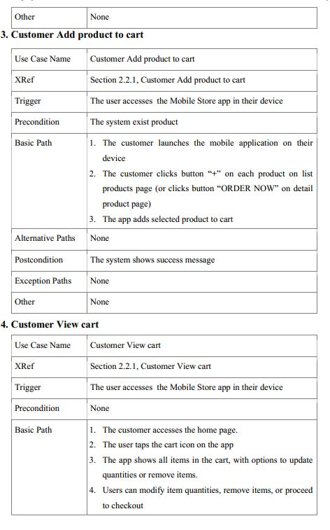
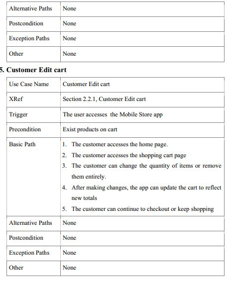

This section outlines the basic functional requirements which include use cases for customer and
admin interactions with the Mobile Store. Here’s a summary:
Customer Use Cases:
- Customer View List Product: Allows the customer to view all products listed on the Mobile
  Store.
- Customer View Detail Product: Allows the customer to view detailed information about a
  specific product.
- Customer Add Product to Cart: Enables customers to add products to their shopping cart.
- Customer View Cart: Allows the customer to view and review the items in their shopping
  cart.
- Customer Edit Cart: Customers can edit the contents of their shopping cart, including
  changing quantities or removing items

